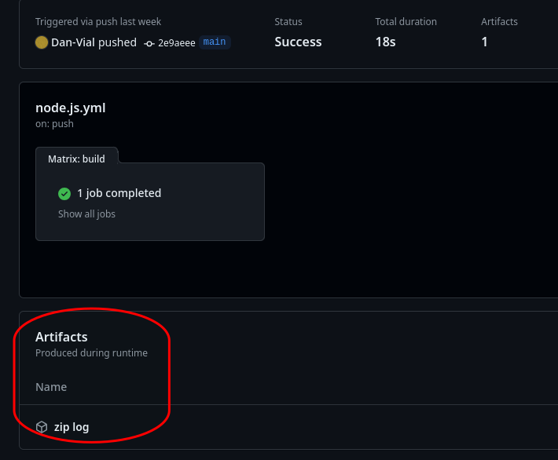
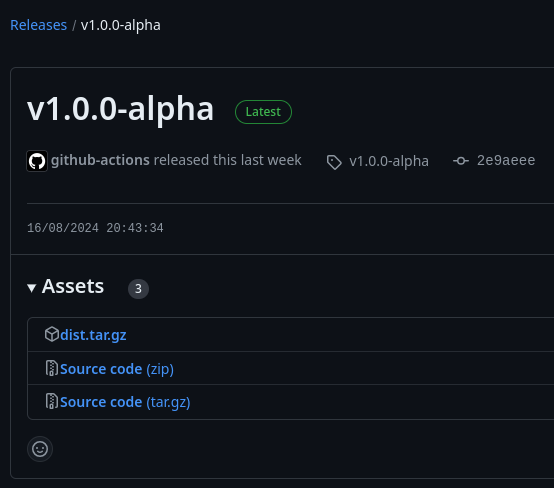

# Learn : test CI.

Dépôt, intégration continue. Une simple démonstration, code factice.

## Les besoins.

- construire l’application : `npm run build`.

- Test de l’application : `npm run test`

- Archive artéfacts: log test…

  

- Archive release : dossier `dist` compresser vers fichier dist.tar.gz

- Page release sur le dépôt git ainsi que son tag : `gh release create TAG ./dist.tar.gz`
  
  

## Action

À chaque `push` sur la `branch main` et un `Tag` valide, on déclenche l’action du workflows.

## Finalité

Automatisation des tâches répétitive, un gain de temps non négligeable.

Un dossier distribuable propre pour la production, tous contenus superflu est supprimé.

## CD déploiement continue
Le déploiement est prêt, chez l’hébergeur vous pouvez automatiser en configurant une tache cron ou un serveur WebHook github qui se chargera de vérifier les nouvelles mise à jour pour les téléchargés et les installés.
